# 🎮 My Next Game
### *AI-Driven Video Game Matchmaker & Retrospective Share-Card Creator*

[](https://angular.io/)
[](https://nodejs.org/)
[](https://expressjs.com/)
[](https://www.typescriptlang.org/)
[](https://deepmind.google/technologies/gemini/)
[](https://api-docs.igdb.com/)
[](https://partner.steamgames.com/doc/webapi_overview)
[](https://vercel.com/)

---

### 🚀 **Hosted URL: [https://my-next-game.vercel.app/](https://my-next-game.vercel.app/)**

**My Next Game** is a modern, full-stack web application designed for gaming enthusiasts. It leverages advanced Artificial Intelligence to solve the age-old problem: *"What should I play next?"* Additionally, it provides an interactive platform for creating, rating, and exporting personalized gaming retrospectives and reviews as beautiful, shareable image cards.

---

## 🧭 Table of Contents
1. [App Overview & Features](#-app-overview--features)
2. [Application Architecture](#%EF%B8%8F-application-architecture)
3. [Technologies Used](#-technologies-used)
4. [Public APIs Utilized](#-public-apis-utilized)
5. [Local Setup & Development](#%EF%B8%8F-local-setup--development)
6. [Deployment](#%EF%B8%8F-deployment)

---

## 🌟 App Overview & Features

The application is structured into three main, feature-rich gaming tools:

### 1. 🎯 AI-Powered Game Matchmaker
Struggling to find a game that matches your specific preferences? The Matchmaker has you covered:
*   **Real-time Game Selector:** Search and choose exactly three games you love. Powered by an RxJS-debounced autocomplete search connecting to the IGDB database.
*   **Themed Interest Exploration:** The backend submits your three games to Gemini 2.5 Flash, which determines their connecting themes and generates a highly tailored, custom 5-question personality/preference quiz.
*   **Interactive Multi-Step Quiz:** A sleek, step-by-step form wizard tracking progress with a visual stepper.
*   **Tailored Recommendation & Reveal:** Submits your quiz answers to Gemini to receive exactly one highly specific game recommendation along with a deep 3-sentence analytical reasoning.
*   **Metadata Hydration:** Automatically retrieves the recommended game's metadata (high-res box art cover, release platforms, summary, and genres) from IGDB to present a gorgeous, premium final recommendation card.

### 2. 📝 Retro Review Card Maker (Retrospective)
Finished a game recently? Create a unique review sheet to share on social media:
*   **Dynamic Evaluation Criteria:** Search for a game you played. Gemini generates 6 to 10 highly distinct, game-specific review dimensions (e.g., *Boss Design*, *Storytelling Pace*, *Combat Fun*, or critiques like *Too Much Grinding?*, *Lag & Bugs*).
*   **Custom Themed Rating Labels:** The star rating levels (1 to 5) are dynamically named based on the game's specific lore, theme, and mood (e.g., *5 Stars* might become *"Absolute Cinema"*).
*   **Witty AI Review Generation:** Once you rate the categories, Gemini synthesizes your ratings into a casual, authentic first-person social media review draft.
*   **High-Res Shareable Cards:** Render a beautiful, glassmorphic card on the frontend and copy the text or download it instantly as a high-quality PNG image card using CORS-compliant `html2canvas` rendering.

### 3. 🏆 AI-Powered Achievements & Trophy Guide
Want to complete everything in your favorite games? The AI Trophy Guide will help you unlock every achievement:
*   **Reactive Autocomplete Search:** Search for any Steam game via an RxJS-debounced autocomplete search connecting to the Steam API proxy.
*   **Comprehensive Trophy Grid:** Displays a list of official game achievements with official icons, titles, and descriptions.
*   **Tactical Gemini Walkthroughs:** Click any trophy to open a sliding side drawer. Gemini generates a linear, step-by-step walkthrough guide detailing estimated difficulty, missable status, time commitment, prerequisites, and a strategic pro-tip.
*   **Local Persistent Caching:** Employs a quick file-backed cache database on the Node.js BFF server. Previously generated walkthroughs load instantly, avoiding Gemini API latency and token fees.
*   **Interactive Micro-Animations & Error Boundaries:** Uses modern skeleton loading states during generation and offers a graceful "Retry generating guide" CTA on API failures.

---

## 🏗️ Application Architecture

The application is designed using a **BFF (Backend-for-Frontend)** architecture patterns. The frontend (Angular) communicates solely with our backend BFF (Express server), which acts as a secure aggregator and proxy for external APIs (Google Gemini and Twitch/IGDB).

### System Interaction Diagram

```mermaid
sequenceDiagram
    autonumber
    actor User as 🎮 Gamer
    participant FE as 🖥️ Angular Frontend (v22)
    participant BE as ⚙️ Express BFF Backend
    participant Gemini as 🤖 Google Gemini API (2.5 Flash)
    participant IGDB as 👾 Twitch / IGDB API

    rect rgb(30, 30, 40)
        Note over User, FE: Phase 1: Game Selection & Autocomplete
        User->>FE: Types game name (debounced input)
        FE->>BE: GET /api/games/search?q=...
        BE->>IGDB: Query games (OAuth2 token cache proxy)
        IGDB-->>BE: Game matches (cover, genres, etc.)
        BE-->>FE: Standardized list of games
        FE-->>User: Display autocomplete dropdown
    end

    rect rgb(40, 30, 40)
        Note over User, Gemini: Phase 2: AI Quiz Generation
        User->>FE: Selects 3 favorite games & clicks "Surprise Me"
        FE->>BE: POST /api/quiz/generate
        BE->>Gemini: gemini-2.5-flash (Structured JSON Schema)
        Gemini-->>BE: 5 Tailored Questions + Theme Connection
        BE-->>FE: Return Quiz JSON
        FE-->>User: Display interactive multi-step quiz
    end

    rect rgb(30, 40, 30)
        Note over User, IGDB: Phase 3: Recommendation Reveal
        User->>FE: Answers questions & submits
        FE->>BE: POST /api/quiz/recommend
        BE->>Gemini: gemini-2.5-flash (Structured Recommendation)
        Gemini-->>BE: Game Title + Deep Reasoning
        BE-->>FE: Recommendation Response
        FE->>BE: GET /api/games/by-title?title=...
        BE->>IGDB: Retrieve precise game metadata
        IGDB-->>BE: Game details (high-res cover art, platforms)
        BE-->>FE: Complete metadata
        FE-->>User: Display Game Reveal Card & AI Reasoning
    end

    rect rgb(30, 40, 40)
        Note over User, Gemini: Phase 4: Retro Review Card Maker
        User->>FE: Inputs name, selects game, requests review sheet
        FE->>BE: POST /api/retrospective/departments
        BE->>Gemini: Generate custom categories & themed star labels
        Gemini-->>BE: Dynamic criteria + 1-5 star ratings
        BE-->>FE: Return criteria list
        User->>FE: Rates game & clicks "Finalize"
        FE->>BE: POST /api/retrospective/finalize
        BE->>Gemini: Generate 1st-person social review
        Gemini-->>BE: Witty review text draft
        BE-->>FE: Return review text
        FE-->>User: Present Share Card (Copy Text / Download PNG)
    end

    rect rgb(40, 40, 30)
        Note over User, Gemini: Phase 5: Achievements & Trophy Guide
        User->>FE: Types game name (debounced input >= 3 chars)
        FE->>BE: GET /api/games/search?q=...&source=steam
        BE->>Steam: Search games (via storefront autocomplete API)
        Steam-->>BE: Game matches (appid, name, logo)
        BE-->>FE: Return game options
        User->>FE: Selects game & views achievements list
        FE->>BE: GET /api/games/:appid & /api/games/:appid/achievements
        Note over BE: Check local JSON/file-backed cache
        alt Cache HIT
            BE-->>FE: Return cached details & achievements instantly
        else Cache MISS
            BE->>Steam: Get schema (key, appid)
            Steam-->>BE: Official Steam schema & achievements list
            BE->>BE: Cache achievements list locally
            BE-->>FE: Return game details & achievements list
        end
        User->>FE: Clicks a trophy
        FE->>BE: POST /api/trophies/guide
        Note over BE: Check local JSON/file-backed cache
        alt Cache HIT
            BE-->>FE: Return cached guide instantly
        else Cache MISS
            BE->>Gemini: Generate guide (application/json schema)
            Gemini-->>BE: Walkthrough steps, difficulty, missable alert, pro-tip
            BE->>BE: Save to data/guides-cache.json
            BE-->>FE: Return walkthrough guide
        end
        FE-->>User: Display step-by-step walkthrough details in slide drawer
    end
```



---

## 🛠️ Technologies Used

### Frontend (`/frontend`)
*   **Framework:** Angular (v22) utilising Standalone Components, Signal state tracking, and reactive structures.
*   **Reactive Programming:** RxJS (`debounceTime`, `distinctUntilChanged`, `switchMap`) for handling search autocomplete streams without spamming APIs.
*   **Canvas Export:** `html2canvas` for screenshotting reviews into local PNG downloads.
*   **Styling:** Custom Vanilla CSS with modern Glassmorphism, linear gradients, neon box shadows, keyframe animations, and a responsive flexbox/grid layout.

### Backend BFF (`/backend`)
*   **Runtime & Language:** Node.js, Express, and TypeScript.
*   **HTTP Client:** `axios` for fast communication with Twitch and IGDB.
*   **Security & Helpers:** `cors` middleware, `dotenv` for environment configurations.

---

## 🔌 Public APIs Utilized

The backend connects to three core external platforms:

### 1. Twitch / IGDB API v4
Used for looking up games and fetching official covers, release platforms, descriptions, and genres.
*   **Authentication:** Utilizes the OAuth2 Client Credentials flow (`https://id.twitch.tv/oauth2/token`).
*   **Token Caching:** The backend implements an **automated memory-caching system** for Twitch App Access tokens. It caches tokens internally and automatically performs a background refresh check when they near expiration, preventing latency spikes on user queries.
*   **Querying:** Accesses `https://api.igdb.com/v4/games` using the IGDB Apex Query Language.

### 2. Google Gemini API
The heart of our AI-driven systems, implemented via the official `@google/genai` SDK.
*   **Structured Output Engine:** Uses Gemini's `responseMimeType: 'application/json'` along with strict `responseSchema` parameters to enforce type safety. This ensures that the generated quiz objects, recommendations, and evaluation criteria never break the frontend parser.
*   **Highly Redundant Fallback Engine:** Features a fallback algorithm across **11 different model configurations and aliases** (from `gemini-2.5-flash` to `gemini-3.1-pro` and legacy versions). If Gemini encounters 429 Rate Limits or Quota Exceeded errors on the free-tier service, it instantly fallbacks to the next available alias, guaranteeing near 100% uptime.

### 3. Steam API
Used for autocomplete searches, retrieving game details, and fetching official achievements lists.
*   **Secure Backend Proxying & API Key:** The Steam API key is configured exclusively on the backend environment variables layer and is never exposed directly to the Angular client.
*   **Schema Fetching & Caching:** The backend fetches the game's achievement schema via `ISteamUserStats/GetSchemaForGame/v2` and caches the results locally to avoid unnecessary API requests.

---

## ⚙️ Local Setup & Development

### Prerequisites
Make sure you have [Node.js](https://nodejs.org/) (v18+ recommended) and `npm` installed.

### 1. Clone & Set Environment Variables
Go to `backend/` and create a file named `.env`:
```env
PORT=3000
IGDB_CLIENT_ID=your_twitch_client_id
IGDB_CLIENT_SECRET=your_twitch_client_secret
GEMINI_API_KEY=your_gemini_api_key
STEAM_API_KEY=your_steam_api_key
```

### 2. Start Backend BFF
Open your terminal:
```bash
cd backend
npm install
npm run dev
```
The backend server will spin up on [http://localhost:3000](http://localhost:3000) using `ts-node` and `nodemon` for hot-reloads.

### 3. Start Frontend
Open a new terminal window:
```bash
cd frontend
npm install
npm start
```
The Angular dev server will launch on [http://localhost:4200](http://localhost:4200) with hot-reloading active.

---

## 🏳️‍🌈 Deployment

Both the frontend and backend are configured for simple deployment to **Vercel** via the respective `vercel.json` configurations:
*   **Frontend Vercel Proxy:** Configured to direct `/api/*` endpoints to the deployed serverless backend.
*   **Backend Vercel Config:** Bundles TypeScript files on Vercel deployment using standard configurations to run Express routes inside serverless environments.

---

*Enjoy finding your next game and sharing reviews!* 🚀🎮
